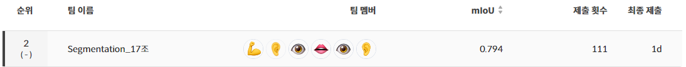
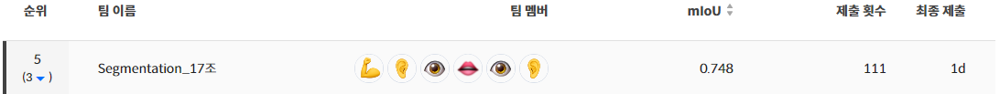

# Semantic Segmentation

## Project 개요

바야흐로 대량 생산, 대량 소비의 시대. 우리는 많은 물건이 대량으로 생산되고, 소비되는 시대를 살고 있습니다. 하지만 이러한 문화는 '쓰레기 대란', '매립지 부족'과 같은 여러 사회 문제를 낳고 있습니다.


분리수거는 이러한 환경 부담을 줄일 수 있는 방법 중 하나입니다. 잘 분리배출 된 쓰레기는 자원으로서 가치를 인정받아 재활용되지만, 잘못 분리배출 되면 그대로 폐기물로 분류되어 매립 또는 소각되기 때문입니다.

따라서 우리는 사진에서 쓰레기를 Segmentation하는 모델을 만들어 이러한 문제점을 해결해보고자 합니다. 문제 해결을 위한 데이터셋으로는 배경, 일반 쓰레기, 플라스틱, 종이, 유리 등 **11 종류의 쓰레기**가 찍힌 사진 데이터셋이 제공됩니다.

여러분에 의해 만들어진 우수한 성능의 모델은 쓰레기장에 설치되어 정확한 분리수거를 돕거나, 어린아이들의 분리수거 교육 등에 사용될 수 있을 것입니다. 부디 지구를 위기로부터 구해주세요! 🌎

### Structure
[Project Structure](#Project-Structure)  
[Data Structure](#Data-Structure)  

### Usage
&nbsp; [1. MMSegmentation](#MMSegmentation)  
&nbsp; [2. Copy Paste](#Copy-Paste)  
&nbsp; [3. CRF](#CRF)  
&nbsp; [4. Pseudo-labeling](#Pseudo-labeling)  

[🏆 Result](#result)


## Project-Structure
```
├─input 
├─configs                                 
│  ├─swin                                 
│  └─_base_                               
│      ├─datasets                         
│      ├─models                           
│      └─schedules                        
├─copy_paste_aug                          
│  ├─configs                              
│  └─__pycache__                          
├─mmseg                                                                             
│  ├─apis                                                    
│  ├─core                                 
│  │  ├─evaluation                                       
│  │  ├─seg                               
│  │  │  ├─sampler                                   
│  │  ├─utils                                      
│  ├─datasets                             
│  │  ├─pipelines                                       
│  ├─models                               
│  │  ├─backbones                                          
│  │  ├─decode_heads                                      
│  │  ├─losses                                             
│  │  ├─necks                                              
│  │  ├─segmentors                                        
│  │  ├─utils                                              
│  ├─ops                                                    
│  ├─utils                                                 
├─submission                              
└─utils          
```

## Data-Structure

```                        
  input                                                                             
   └─data                                                                                   
      ├─test   
      │ └─img                              
      ├─train 
      │ ├─img
      │ └─ann                                                             
      └─val
        ├─img
        └─ann                                
```

## MMSegmentation
### Installation

a. Create Environment

```
apt-get update
conda create --name {input_name} --file spec-file.txt
```

b. Install Requirements
```
pip install -r requirements.txt
```

c. Install Pytorch & MMSegmentation
- pytorch : 1.7.1 | torchvision : 0.8.2 | torchaudio : 0.7.2 | cudatoolkit : 11.0
```
conda install pytorch==1.7.1 torchvision==0.8.2 torchaudio==0.7.2 cudatoolkit=11.0 -c pytorch
mim install mmsegmentation
pip install mmcv-full -f https://download.openmmlab.com/mmcv/dist/cu110/torch1.7.0/index.html
```

### Train

```
python mmseg_train.py --config_train ./configs/train.yaml
```

### Train yaml

```
# -- config path
config_dir : config file이 속한 directory(str)
config_file : config file path(str)

## -- wandb
wandb : wandb 사용 여부(bool)
wandb_proj : wandb project name(str)
wandb_name : wandb name(str)
log_interval : log & wandb interval(int)

# -- hyperparameter
seed : random seed(int)
batch_size : sample_per_gpu(int)
lr : learning rate(int)

# -- validation
validate : validation 사용 여부(bool)
eval_interval : validation 실행 interval(int)

# -- checkpoint
use_ckpt : load checkpoint 여부(bool)
ckpt_name : checkpoint name(str)

## -- save best model
save_best_model : 점수가 best인 model을 저장할지 여부(bool)
```

### Inference

```
python mmseg_inference.py --config_train ./configs/inference.yaml
```

### Inference yaml

```
# -- config path
config_dir : config file이 속한 directory(str)
config_file : config file path(str)

# -- checkpoint
ckpt_name : checkpoint name(str)

# -- save csv name
csv_name : infernece한 결과의 csv file name(str)
```

## Copy-Paste

### Running
```
python copy_paste_aug/copy_paste_main.py --config ./copy_paste_aug/configs/cp_config.yaml
```
### Copy Paste yaml
```
img_size : RandomScale, PadIfNeeded에 사용할 image size(int)
data_root : *.json 파일이 속한 directory(str)
ann_file : *.json의 path

# -- RandomScale
limit_min : RandomScale의 scale_limit의 minimum 값(float)
limit_max : RandomScale의 scale_limit의 maximum 값(float)
rs_p : 적용 비율(float)

# -- CopyPaste
sigma : sigma 값(float)
pct_objects_paste : 선택한 object 중 얼마나 가져올 것인가(float)
cp_p : 적용 비율(float)

# -- save file name
start_num : 저장되는 image file의 몇 번부터 시작할 것인가(int)
```
## CRF

### Installation
a. Create New Environment
```
conda create -n crf python=3.6.9    
conda activate crf
```
you must install python 3.6 or lower

b. Install Requirements
```
pip install -r requirements.txt
```
c. Install pydensecrf
```
pip install cython
conda install -c conda-forge pydensecrf
```
d. Install cv2
```
pip install opencv-python
```
### Running
Correct the 3rd line and RUN **utils/apply-crf.ipynb**
```
df = pd.read_csv('yourpath.csv')
```
## Pseudo-labeling
### Make Img and Ann file
```
# In 3th cell at utils/Pseudo-labeling.ipynb
df = pd.read_csv('output.csv')
-> path of output csv file you want to pseudo-labeling
test_path = '/opt/ml/segmentation/input/data/test/img/'
-> path of test dataset
img_path = '/opt/ml/segmentation/input/data/pseudo/img/'
-> path of new image file to save
ann_path = "/opt/ml/segmentation/input/data/pseudo/ann/"
-> path of new ann file to save
```
### Running
```
python ./utils/labeling.py
```
```
# In utils/labeling.py
img = cv2.imread(f'img/{current_idx}.jpg')
-> img = path of test dataset
ann = cv2.imread(f'ann/{current_idx}.png')    
-> ann = path of newly created ann file
ann2 = cv2.imread(f'ann2/{current_idx}.png')
-> ann2 = path of another ann file for comparison
```

## 🏆Result

### Public Score


### Private Score


### Evaluation & Ensemble
|   <div align="center">Model </div>	|  <div align="center">Public mIoU </div> 	|<div align="center">Private mIoU </div>
|---	|---	|---	|
| <div align="center">Swin-L (UperNet) </div>	|  <div align="center">0.789 </div> 	|  <div align="center">0.742 </div> 	|
| <div align="center">Swin-L (UperNet) </div>	|  <div align="center">0.785 </div> 	|  <div align="center">0.741 </div> 	|
| <div align="center">Swin-L (UperNet) </div>	|  <div align="center">0.782 </div> 	|  <div align="center">0.742 </div> 	|
| <div align="center">HRNetv2 W48 </div>	|  <div align="center">0.701 </div> 	|  <div align="center">0.639 </div> 	|
| <div align="center">Ensemble </div>	|  <div align="center">0.794 </div> 	|  <div align="center">0.748 </div> 	|
### Single Model Score History
[Semantic Segmentation](./_img/Semantic_Segmentation.svg)

## Members

|   <div align="center">김주영 </div>	|  <div align="center">오현세 </div> 	|  <div align="center">채유리 </div> 	|  <div align="center">배상우 </div> 	|  <div align="center">최세화 </div>  | <div align="center">송정현 </div> |
|---	|---	|---	|---	|---	|---	|
| 	|   	|   	|   	|  |  |
|   <div align="center">[Github](https://github.com/JadeKim042386)</div>	|   <div align="center">[Github](https://github.com/5Hyeons)</div>	|   <div align="center">[Github](https://github.com/yoorichae)</div>	|   <div align="center">[Github](https://github.com/wSangbae)</div>	| <div align="center">[Github](https://github.com/choisaywhy)</div> | <div align="center">[Github](https://github.com/pirate-turtle)</div>|